Introduction
------------

Following report discusses the findings of qunatitative analysis that
was conducted on \***World Development Indicators** dataset. In this
excercie we tried to study economic, social and enviornmental
development of regions and their countires. This document also briefly
outlines the walkthrough of process that was followed for this
excercise.

The primary aim of this analysis was to study global evolution and to
identify factors that contributed in growth or shrikage of countries’
perfomance in different sectors, and to summarize findings supported by
emperical eveidence.

Dataset
-------

The dataset used for this analysis was orignally released by Workd Bank
as “World Development Indicators”. It is a collection of development
indicators, compiled from several officially-recognized international
sources. The dataset was officialy made available on google big query
under public license.

As stated on their official website;

> … It (WDI) presents the most current and accurate global development
> data available, and includes national, regional and global estimates

### Dimensions

Following is the list of dimensions that were obtained as the result of
intial pre-processing;

-   Indicator
-   Region
-   Country
-   Decade
-   Year

### Indicators

Indicators were further narrowed down by grouping them into logical
categories. Following are the resulting handpicked indicators;

**a. Social**

-   Pupil-teacher ratio, primary
-   Government expenditure on education, total (% of government
    expenditure)
-   Access to electricity (% of population)
-   Birth rate, crude (per 1,000 people)
-   Population growth (annual %)

**b. Enviornmental**

-   CO2 emissions (metric tons per capita)
-   Total greenhouse gas emissions (kt of CO2 equivalent)
-   Forest area (sq. km)
-   Population density (people per sq. km of land area)
-   Life expectancy at birth, total (years)

**c. Economic**

-   GDP per capita (current US$)
-   GDP growth (annual %)
-   GDP per capita growth (annual %)
-   Expense (% of GDP)
-   GNI per capita (constant 2010 US$)

Pre-processing
--------------

Final dataset was obtained after running preprocessing internally on R
and externally on SQL based platform. Following report only covers
pre-processing routine that were covered within R. Queries and code
snippets for external pre-processing were hence skipped intentinoally.
External pre-prorcessing produced twp CSVs;

-   wdi-f.csv
-   Group\_comparison.csv

Following are code snippets of internal pre-processing;

-   Regions were added to all countries

-   Indicator were reanmed to shorter names for easier referencing

-   Dataset was aggregated over different dimensions

-   Dataset was normalize for some operations using min-max
    normalization

-   The orignal structure of dataset was transformed using data
    transformation techniques to make processing more convenient
-   Data was trasnformed from long to wide format

-   Missing value were treated by filling it with mean of respective
    column

-   Metric of Social Prosperity and Environment Friendliness was added
-   Following were the expressions for above mentioned metrics;

               **Social Prosperity =
log(education\_expense*electricity\_access*life\_expectancy) /
log(teacher\_per\_pupil*birth\_rate*population\_growth)**

               **Enviornment Friendliness = log(population\_density) /
log(co2\_emission*greenhouse\_emission*forest\_area)**

Findings
--------

### Economic trends for regions and countries since 1960


**Regional Economogy**

-   Middle east was the leader until 1990
-   Scandinavia overtook North America in 1975 and 1995
-   South Asia didn’t show any drastic growth
-   Disparity started increasing after 1990


**International Economoy**

-   UAE and Qatar had highest gdp growths until 1970
-   Norway and Denmark showed highest growth in recent decade

### Effect of Social prosperity and enviornmental prosperity over economy, before and after 2000

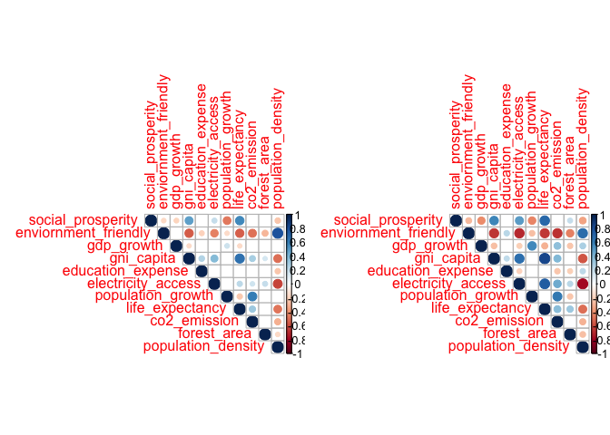

**Before 2000**

-   Electricity access decreased, with increase in Population density
-   Life Expectancy is heavily dependent on GNI and Social Prosperity

**After 2000**

-   All dependencies are still relevant
-   Strength of dependencies intensified

### History Over Time: Country’s journey to prosperity/failure from 1960 to 2018

-   We were curious to know what is the secret of the successful
    countries.
-   The report shows the indicators that have the greatest impact on
    making countries “rich and healthy”.
-   We would like to know if we can find the “formula” of the richest
    and most comfortable countries based on the facts obtained from the
    indicators.
-   We took y axis for life expectancy and x axis for wealth - Gross
    National Income Of countries.
-   We wanted to visualise the “movement” of the countries on the graph
    based on mentioned parameters above. From “poor and sick” up to
    “rich and healthy”.
-   At first, we will show the world 58 years ago in 1960, over the
    countries of Africa, Asia, Middle East, America and Europe.
-   The size of the point area shows the population density.

-   Colombia / Chile / Costa Rica have a good leap towards higher income
-   Benin has a big leap towards life expectancy
-   Life expectancy in Bostwana decreased around 1990\~2000
-   The life expectancy of Ecuador (the poorest country) increases
    significantly
-   Life expectancy in Bangladesh increased to 75 from 45 years over the
    period (1975-2018)

### Regional population growth trends since 1960

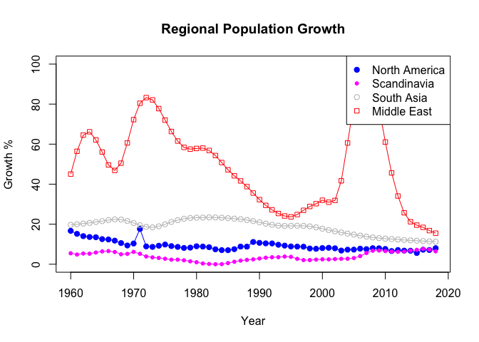

-   Middle east was most populated in history
-   North America overtook Scandinavia region in late 2020
-   Trends didn’t change throughout history

### Good seprators (indicators) for rich and poor countries

#### Social indicators and High/Low/Mid income countries

**a. High Income countries**

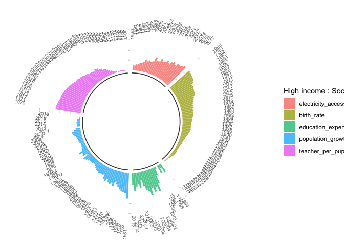

-   Pupil-teacher ratio, primary: Decreases with time. Lower after 2010.
-   Government expenditure on education, total (% of government
    expenditure): Not consistent, but maintains certain threshold.
-   Access to electricity (% of population): Increases with time.
-   Birth rate, crude (per 1,000 people): Decreases with time.
-   Population growth (annual %): Decreases with time. After 2010 almost
    constant.

**b. Middle Income countries**

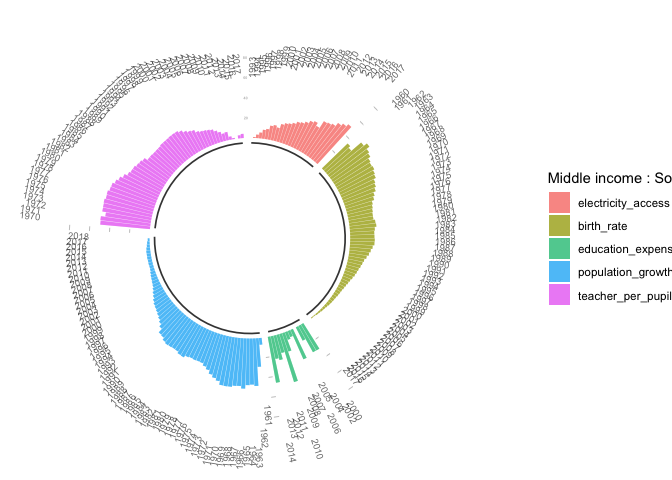

-   Pupil-teacher ratio, primary: Higher compared to rich countries and
    increases more.
-   Government expenditure on education, total (% of government
    expenditure): Increases but we have less data here.
-   Access to electricity (% of population): Almost equal and increases
    over time.
-   Birth rate, crude (per 1,000 people): A bit Higher but also
    decreases more.
-   Population growth (annual %): Decreases more compared to High income
    countries.

Pupil-teacher ratio, Birthrate are the indicators which are separating
Middle from High income countries.

**c. Low Income countries:**

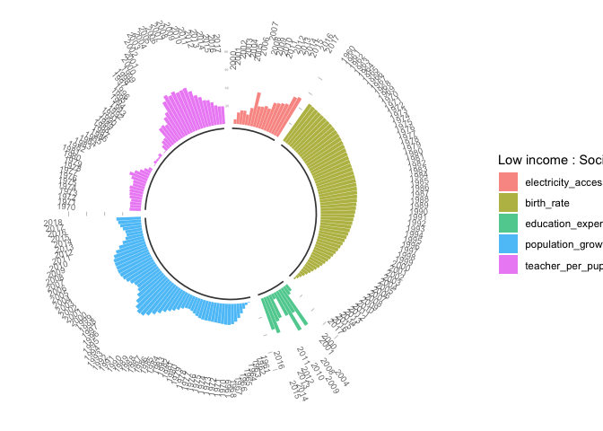

-   Pupil-teacher ratio, primary: Trend is totally opposite compared to
    above groups(inconsistent).
-   Government expenditure on education, total (% of government
    expenditure): Decreases with time which is not ideal compared to
    other groups.
-   Access to electricity (% of population): Higher which is similar to
    high and middle income countries.
-   Birth rate, crude (per 1,000 people): Decreases which is also a good
    indicator.
-   Population growth (annual %): Not consistent and also higher.

Pupil-teacher ratio, primary, Government expenditure on education and
population growth are the clear distinction between High and Middle
income countries.

#### Environmental indicators and High/low/mid income countries

**a. High Income countries**

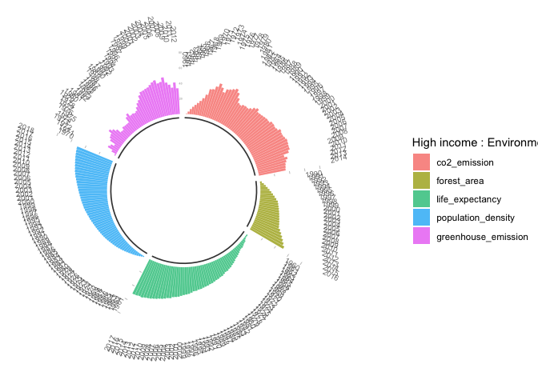

-   CO2 emissions (metric tons per capita): Maintains threshold value
    after 1967.
-   Total greenhouse gas emissions (kt of CO2 equivalent): Increases
    with time
-   Forest area (sq. km): Increases with time.
-   Population density (people per sq. km of land area): Increase with
    time.
-   Life expectancy at birth, total (years): Increases with time

**b. Middle Income countries**

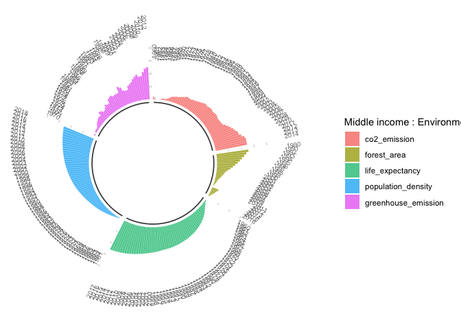

-   CO2 emissions (metric tons per capita): Lower compared to rich
    countries and increases.
-   Total greenhouse gas emissions (kt of CO2 equivalent): Lower but
    increasing.
-   Forest area (sq. km): Decreasing over time (Opposite trend spotted).
-   Population density (people per sq. km of land area): Increases
    almost the same as high income.
-   Life expectancy at birth, total (years): Increases almost the same
    as high income.

CO2 emissions, Forest area and Greenhouse emission are in some sense
good distinguishing factors.

**c. Low Income countries**

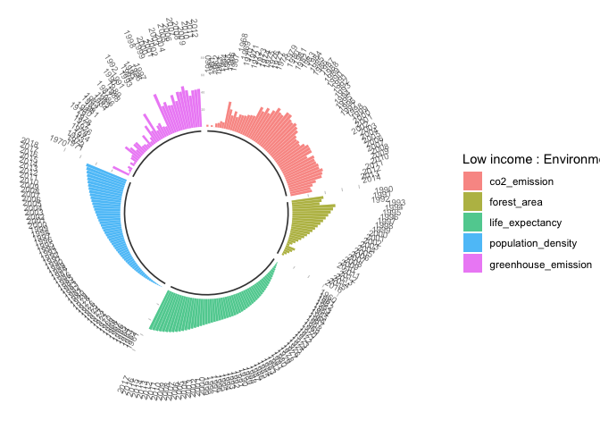

-   CO2 emissions (metric tons per capita): Much higher, almost the same
    as in High income countries.
-   Total greenhouse gas emissions (kt of CO2 equivalent): Increased
    after 2000 and almost did not change.
-   Forest area (sq. km): Higher compared with the Middle income, but a
    similar trend.
-   Population density (people per sq. km of land area): Lower than in
    Middle income countries, but also increases with time.
-   Life expectancy at birth, total (years): Lower than Middle income
    countries and increases over time.

High and Low income countries make a larger contribution to
environmental pollution.

#### Economical indicators and High/low/mid income countries

**a. High Income countries**

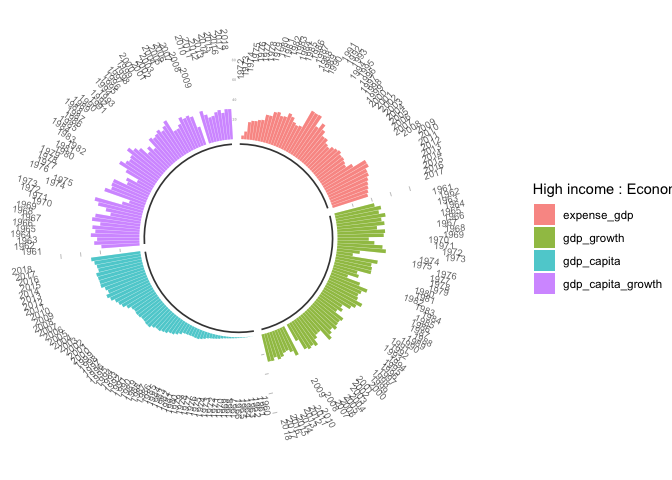

-   GDP per capita (current US$): Increases with time.
-   GDP growth (annual %): Increases over time.
-   GDP per capita growth (annual %): No obvious pattern but above a
    certain threshold.
-   Expense (% of GDP): Increases with time.

**b. Mid Income countries**

``` r
plot_circular_bar(llong,"Economical","Middle income")
```

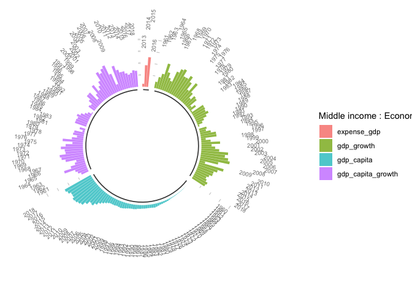

-   GDP per capita (current US$): Probably lower and also increases with
    time
-   GDP growth (annual %): Lower and no obvious pattern over time
-   GDP per capita growth (annual %): Lower and also no obvious pattern
-   Expense (% of GDP): Low data

**c. Low Income countries**

``` r
plot_circular_bar(llong,"Economical","Low income")
```

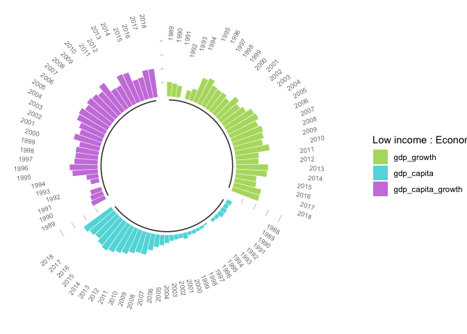

-   GDP per capita (current US$): Lower and increases with time
-   GDP growth (annual %): Probably lower and no clear pattern but
    maintains threshold.
-   GDP per capita growth (annual %): Probably lower. No clear pattern
    but maintains a threshold.
-   Expense (% of GDP): No data.
-   GNI per capita (constant LCU): No data.

All these groups have a similar tendency of growth of GDP per capita,
but clear distinction could be spotted on GDP and GDP per capita growth.
High and Middle income countries has higher growth.

#### The challenges we faced:

The “Circular barplot with groups” were used to visualise the difference
between Hight, Middle and Low income countries by 3 indicators. Each bar
represents a value. The problem we faced was that some indicators have
missing values (NA) in particular years. And if we plotted the data
without removing the missing values we get so much “empty” bars (with no
value meaning) that it impossible to interpret the data. That is why it
was necessary to take out the missing values, in order to have visible
and understandable representation.

### Effect of social prosperity on economic prosperity

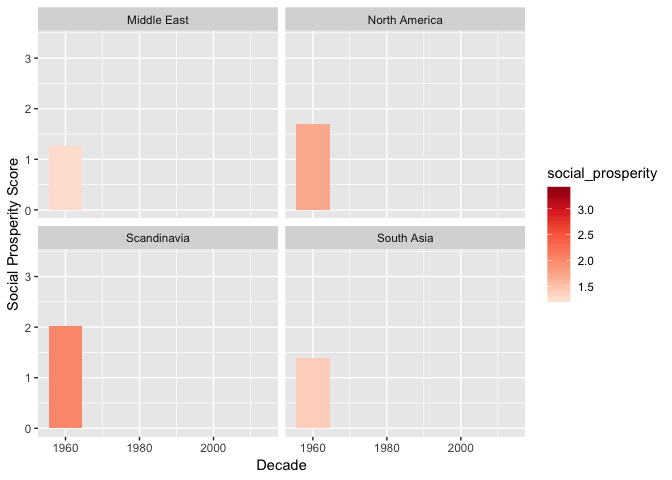

-   Economic success resulted social prosperity for region North America
    and Scandinavia
-   Social prosperity of region South Asia and Middle East has not
    witness any drastic change

References
----------

<a href="https://datacatalog.worldbank.org/dataset/world-development-indicators" class="uri">https://datacatalog.worldbank.org/dataset/world-development-indicators</a>
<a href="http://www.humantruth.info/regional_comparisons.html" class="uri">http://www.humantruth.info/regional_comparisons.html</a>
<a href="https://www.sciencedirect.com/topics/social-sciences/socio-economic-indicators" class="uri">https://www.sciencedirect.com/topics/social-sciences/socio-economic-indicators</a>
<a href="http://www.fao.org/3/y5228e/y5228e03.htm" class="uri">http://www.fao.org/3/y5228e/y5228e03.htm</a>
<a href="https://www.rstudio.com/wp-content/uploads/2015/02/rmarkdown-cheatsheet.pdf" class="uri">https://www.rstudio.com/wp-content/uploads/2015/02/rmarkdown-cheatsheet.pdf</a>
